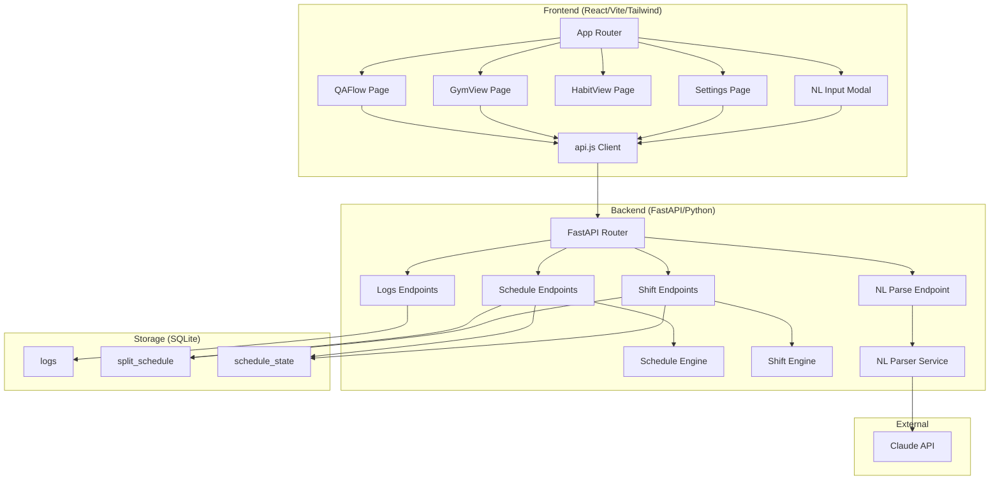

# Design Document: Compound v2

## Overview

Compound v2 is a multi-phase redesign of the existing personal habit and gym tracking application. The current system uses a manual form (AddLog) that requires the user to pick a category, type a metric name, and enter a numeric value. The redesign replaces this with a guided Q&A flow, introduces a new visual identity inspired by Monkeytype, restructures the Gym page, adds split-aware scheduling with dynamic shifting, and layers a natural-language input mode on top.

### Design Goals

- Replace the generic AddLog form with a purpose-built sequential Q&A flow
- Apply a cohesive minimal dark theme (JetBrains Mono, charcoal background, single accent #FF4F00)
- Redesign the Gym page with personal records, progress charts, and split awareness
- Implement a 7-day repeating split schedule with dynamic shift operations
- Add optional Claude-powered natural-language input as a parallel logging path
- Deliver incrementally in phased commits on a `compound-v2/` feature branch

### Implementation Phases

| Phase | Scope |
|-------|-------|
| 1 | Theme overhaul + Gym page redesign |
| 2 | Q&A flow + split schedule backend |
| 3 | Split-aware logging + dynamic shifting |
| 4 | Natural-language input mode |

## Architecture

### System Diagram



### Technology Stack

| Layer | Technology | Notes |
|-------|-----------|-------|
| Frontend | React 18, Vite 5, Tailwind CSS 3 | Existing stack, no changes |
| Charting | Recharts 2 | Existing dependency |
| Backend | Python, FastAPI 0.115, Pydantic 2 | Existing stack |
| Database | SQLite with WAL mode | Existing, add 2 new tables |
| NL Parsing | Anthropic Python SDK (Claude) | New dependency, Phase 4 only |
| Font | JetBrains Mono (Google Fonts) | Replaces Press Start 2P for body |

## Components and Interfaces

### Backend Components

#### Schedule Engine (`backend/schedule_engine.py`)

Pure-logic module for schedule computations. No I/O.

```python
from datetime import date
from typing import Optional

SPLIT_CYCLE = ["Pull", "Push", "Legs", "Rest", "Upper", "Rest", "Lower"]

def get_day_type(cycle_start_date: date, query_date: date) -> str:
    """Compute Day_Type for a given date.
    
    Returns one of: Pull, Push, Legs, Rest, Upper, Lower
    Raises ValueError if cycle_start_date is None.
    """
    delta = (query_date - cycle_start_date).days
    day_index = delta % 7
    return SPLIT_CYCLE[day_index]

def get_day_index(cycle_start_date: date, query_date: date) -> int:
    """Compute day_index (0-6) for a given date."""
    delta = (query_date - cycle_start_date).days
    return delta % 7

def get_week_schedule(cycle_start_date: date, start_date: date) -> list[dict]:
    """Return the next 7 days with their date and Day_Type."""
    result = []
    for i in range(7):
        d = start_date + timedelta(days=i)
        result.append({
            "date": d.isoformat(),
            "day_index": get_day_index(cycle_start_date, d),
            "day_type": get_day_type(cycle_start_date, d),
        })
    return result
```

#### Shift Engine (`backend/shift_engine.py`)

Pure-logic module for dynamic schedule shifting. Operates on a list of scheduled day entries.

```python
from datetime import date, timedelta
from typing import Optional

def compute_shift(
    cycle_start_date: date,
    unavailable_date: date,
    split_cycle: list[str],
) -> date:
    """Compute new cycle_start_date after marking unavailable_date.
    
    Algorithm:
    1. Identify the day_index of unavailable_date
    2. Look at remaining days in the cycle after unavailable_date
    3. If a Rest day exists in remaining days, absorb it (only the first one)
    4. Shift cycle_start_date back by 1 day (effectively pushing all days forward by 1)
    5. If a rest was absorbed, shift forward again by 1 to compensate
    
    Returns the new cycle_start_date.
    Raises ValueError if unavailable_date <= today.
    """
    ...

def validate_shift_request(unavailable_date: date, today: date) -> Optional[str]:
    """Return error message if request is invalid, None if valid."""
    if unavailable_date <= today:
        return "Only future dates may be marked as unavailable"
    return None
```

#### NL Parser Service (`backend/nl_parser.py`)

Wraps Claude API calls for natural-language parsing.

```python
from typing import Optional
import anthropic

class NLParserService:
    def __init__(self, api_key: str):
        self.client = anthropic.Anthropic(api_key=api_key)
    
    async def parse_input(self, text: str, today: str) -> dict:
        """Parse free-text input into structured log entries.
        
        Returns: {
            "entries": [
                {"category": str, "metric": str, "value": float, "notes": str|None, "date": str}
            ],
            "errors": [str]  # any portions that could not be parsed
        }
        Raises TimeoutError after 30 seconds.
        """
        ...
    
    def build_prompt(self, text: str, today: str) -> str:
        """Build the Claude prompt with schema instructions."""
        ...
```

#### API Endpoints (additions to `backend/main.py`)

```python
# Schedule endpoints
@app.get("/api/schedule/today")
def get_today_schedule() -> dict:
    """Returns {date, day_type, day_index} or {configured: false}"""

@app.get("/api/schedule/week")
def get_week_schedule(start_date: Optional[str] = None) -> list[dict]:
    """Returns next 7 days with day_type for each"""

@app.get("/api/schedule/config")
def get_schedule_config() -> dict:
    """Returns {cycle_start_date, split_cycle: [...]}"""

@app.put("/api/schedule/config")
def update_schedule_config(body: ScheduleConfigUpdate) -> dict:
    """Update cycle_start_date. Validates date range."""

# Shift endpoint
@app.post("/api/schedule/shift")
def shift_schedule(body: ShiftRequest) -> dict:
    """Mark a day unavailable, shift schedule forward.
    Returns the updated week schedule."""

# NL Parse endpoint (Phase 4)
@app.post("/api/nl/parse")
async def parse_natural_language(body: NLParseRequest) -> dict:
    """Parse free-text, return structured entries for confirmation."""
```

### Frontend Components

#### QAFlow (`frontend/src/pages/QAFlow.jsx`)

State machine for the sequential question flow.

```typescript
// State shape
interface QAState {
  currentStep: number;  // 0-based index into questions
  answers: Record<string, any>;  // step_key -> value
  gymExercises: GymExercise[];  // accumulator for gym entries
  isSubmitting: boolean;
  errors: string[];
}

// Steps: sleep_quality -> water_oz -> protein_g -> gym_attendance -> [gym_exercises] -> review
type StepKey = 'sleep_quality' | 'water_oz' | 'protein_g' | 'gym_attendance' | 'gym_exercises' | 'review';

interface GymExercise {
  name: string;
  weight: number;
  reps: number;
  sets: number;
}
```

Key behaviors:
- Auto-advance after 300ms on numeric input confirmation
- Back button preserves all entered values
- Skip sets answer to `null` and advances
- On completion, maps answers to Log_Entry records and POSTs via `createLog()`

#### GymView Redesign (`frontend/src/pages/GymView.jsx`)

```typescript
interface GymViewState {
  logs: LogEntry[];
  metrics: string[];
  selectedMetric: string;
  personalRecords: Record<string, number>;  // metric -> max value
  loading: boolean;
}
```

Key behaviors:
- Compute personal records client-side: `max(value)` per metric
- Highlight PR values in both chart (dot color) and table (text color) with #FF4F00
- Chart above, table below, 24px gap

#### Settings Page (`frontend/src/pages/Settings.jsx`)

New page for split schedule configuration.

```typescript
interface SettingsState {
  cycleStartDate: string | null;
  splitCycle: {day_index: number, day_type: string}[];
  weekPreview: {date: string, day_type: string}[];
  editingDate: string;
  error: string | null;
}
```

#### Theme System Updates

Replace existing Tailwind config colors and CSS classes:

- Remove: `gym-red`, `gym-orange`, `academic-blue`, `habit-green`, `quest-purple`, `quest-gold`
- Remove: `font-pixel` usage from body text (keep for special headers only or remove entirely)
- Add: `accent: '#FF4F00'` as the single highlight color
- Keep: `charcoal`, `charcoal-light`, `charcoal-lighter` (already correct)
- Change: All body text to `font-body` (JetBrains Mono)
- Remove: All `panel-glow-*` classes, no box-shadow at rest

### API Client Extensions (`frontend/src/api.js`)

```javascript
// Schedule
export const getTodaySchedule = () => request('/schedule/today');
export const getWeekSchedule = (startDate) => 
  request(`/schedule/week${startDate ? `?start_date=${startDate}` : ''}`);
export const getScheduleConfig = () => request('/schedule/config');
export const updateScheduleConfig = (data) => 
  request('/schedule/config', { method: 'PUT', body: JSON.stringify(data) });
export const shiftSchedule = (data) => 
  request('/schedule/shift', { method: 'POST', body: JSON.stringify(data) });

// NL Parse
export const parseNaturalLanguage = (data) => 
  request('/nl/parse', { method: 'POST', body: JSON.stringify(data) });
```

## Data Models

### Existing Tables (unchanged)

#### `logs`
| Column | Type | Constraints |
|--------|------|-------------|
| id | INTEGER | PRIMARY KEY AUTOINCREMENT |
| date | TEXT | NOT NULL, DEFAULT date('now') |
| category | TEXT | NOT NULL |
| metric | TEXT | NOT NULL |
| value | REAL | NOT NULL |
| notes | TEXT | nullable |

### New Tables

#### `split_schedule`
| Column | Type | Constraints |
|--------|------|-------------|
| day_index | INTEGER | PRIMARY KEY, CHECK(day_index >= 0 AND day_index <= 6) |
| day_type | TEXT | NOT NULL, CHECK(day_type IN ('Pull','Push','Legs','Rest','Upper','Lower')) |

Seeded on first init with the fixed cycle:
```sql
INSERT INTO split_schedule VALUES (0, 'Pull'), (1, 'Push'), (2, 'Legs'),
  (3, 'Rest'), (4, 'Upper'), (5, 'Rest'), (6, 'Lower');
```

#### `schedule_state`
| Column | Type | Constraints |
|--------|------|-------------|
| id | INTEGER | PRIMARY KEY, always 1 (single-row table) |
| cycle_start_date | TEXT | nullable, ISO 8601 date |

Single-row pattern: only one row with id=1 stores the current cycle start date.

### New Pydantic Models (`backend/models.py` additions)

```python
class ScheduleConfigUpdate(BaseModel):
    cycle_start_date: str  # ISO 8601 date, validated in endpoint

class ScheduleConfigResponse(BaseModel):
    cycle_start_date: Optional[str]
    split_cycle: list[dict]  # [{day_index: int, day_type: str}]

class ScheduleTodayResponse(BaseModel):
    date: str
    day_type: Optional[str]
    day_index: Optional[int]
    configured: bool

class WeekDayResponse(BaseModel):
    date: str
    day_index: int
    day_type: str

class ShiftRequest(BaseModel):
    unavailable_date: str  # ISO 8601, must be future

class ShiftResponse(BaseModel):
    new_cycle_start_date: str
    week_schedule: list[WeekDayResponse]
    absorbed_rest: bool

class NLParseRequest(BaseModel):
    text: str  # max 2000 chars

class NLParseResponse(BaseModel):
    entries: list[dict]  # [{category, metric, value, notes, date}]
    errors: list[str]

class GymExerciseInput(BaseModel):
    name: str  # max 50 chars
    weight: float  # 0-2000
    reps: int  # 1-100
    sets: int  # 1-50
```

### Database Migration Strategy

Since SQLite doesn't support formal migrations and this is a personal project, the `init_db()` function in `database.py` will be extended with `CREATE TABLE IF NOT EXISTS` statements for the two new tables. The existing `logs` and `threads` tables remain unchanged.

```python
def init_db():
    with get_db() as conn:
        # ... existing tables ...
        
        conn.execute("""
            CREATE TABLE IF NOT EXISTS split_schedule (
                day_index INTEGER PRIMARY KEY CHECK(day_index >= 0 AND day_index <= 6),
                day_type TEXT NOT NULL CHECK(day_type IN ('Pull','Push','Legs','Rest','Upper','Lower'))
            )
        """)
        conn.execute("""
            CREATE TABLE IF NOT EXISTS schedule_state (
                id INTEGER PRIMARY KEY CHECK(id = 1),
                cycle_start_date TEXT
            )
        """)
        # Seed split_schedule if empty
        count = conn.execute("SELECT COUNT(*) FROM split_schedule").fetchone()[0]
        if count == 0:
            conn.executemany(
                "INSERT INTO split_schedule (day_index, day_type) VALUES (?, ?)",
                [(0,'Pull'),(1,'Push'),(2,'Legs'),(3,'Rest'),(4,'Upper'),(5,'Rest'),(6,'Lower')]
            )
        # Ensure schedule_state row exists
        conn.execute("INSERT OR IGNORE INTO schedule_state (id, cycle_start_date) VALUES (1, NULL)")
```

### Shift Algorithm Detail

The dynamic schedule shifting algorithm works as follows:

```
Input: cycle_start_date, unavailable_date, split_cycle[7]
Precondition: unavailable_date > today

1. Compute day_index of unavailable_date:
   idx = (unavailable_date - cycle_start_date).days % 7

2. Collect remaining_indices = indices from idx+1 through 6 (wrapping)
   These are the days that get pushed forward.

3. Search remaining_indices for first Rest day:
   rest_found = first i in remaining_indices where split_cycle[i] == 'Rest'

4. New cycle_start_date = cycle_start_date - timedelta(days=1)
   (Shifting start back by 1 is equivalent to pushing all future days forward by 1)

5. If rest_found:
   new_cycle_start_date = new_cycle_start_date + timedelta(days=1)
   (Absorbing the rest day cancels one day of shift for days beyond it)

6. Return new_cycle_start_date
```

This approach maintains the single `cycle_start_date` as the source of truth. The modulo arithmetic ensures the cycle repeats indefinitely. Shifting the start date effectively shifts all future day assignments.

### Theme Token Map

| Token | Old Value | New Value | Usage |
|-------|-----------|-----------|-------|
| `charcoal` | #1a1a1f | #1a1a1f | Base background (unchanged) |
| `charcoal-light` | #242430 | #242430 | Panel backgrounds (unchanged) |
| `charcoal-lighter` | #2e2e3a | #2e2e3a | Borders, hover states (unchanged) |
| `accent` | — | #FF4F00 | XP fills, PRs, streaks, goal completions |
| `text-primary` | — | #e5e7eb | Primary text (gray-200) |
| `text-secondary` | — | #6b7280 | Secondary text (gray-500) |
| `text-muted` | — | #9ca3af | Labels, tertiary (gray-400) |
| `gym-red` | #e85d4a | REMOVED | — |
| `habit-green` | #22c55e | REMOVED | — |
| `quest-purple` | #a855f7 | REMOVED | — |
| `quest-gold` | #eab308 | REMOVED | — |

## Correctness Properties

*A property is a characteristic or behavior that should hold true across all valid executions of a system — essentially, a formal statement about what the system should do. Properties serve as the bridge between human-readable specifications and machine-verifiable correctness guarantees.*

### Property 1: Back Navigation Preserves State

*For any* sequence of answered questions in the QA flow and any sequence of back-navigations, revisiting a previously answered step SHALL always display the previously entered value unchanged.

**Validates: Requirements 1.5**

### Property 2: QA Answer to Log_Entry Mapping

*For any* set of valid QA answers (sleep quality 1-10, water oz 0-300, protein g 0-1000, and 0-20 gym exercises with valid name/weight/reps/sets), the generated Log_Entry records SHALL have: sleep → category "sleep", metric "sleep_quality"; water → category "hydration", metric "oz_water"; protein → category "habit", metric "protein_g"; each gym exercise → category "gym", metric = exercise name, value = weight, notes = "{reps}r x {sets}s".

**Validates: Requirements 1.7**

### Property 3: Gym Table Displays At Most 20 Entries Sorted by Date

*For any* non-empty set of gym log entries, the recent entries table SHALL display at most 20 entries and they SHALL be sorted by date descending.

**Validates: Requirements 3.2**

### Property 4: Personal Record Equals Maximum Value Per Metric

*For any* non-empty list of log entries for a given exercise metric, the personal record value SHALL equal the maximum numeric value in that list.

**Validates: Requirements 3.4**

### Property 5: Chart Filter Shows Only Selected Metric

*For any* selected metric and any set of gym log entries containing multiple distinct metrics, the chart data SHALL contain only entries where metric equals the selected metric, and the table SHALL contain entries for all metrics.

**Validates: Requirements 3.6**

### Property 6: Day_Type Computation via Modulo Arithmetic

*For any* valid cycle_start_date and any query_date (past, present, or future), the computed day_index SHALL equal `(query_date - cycle_start_date).days % 7` and the returned Day_Type SHALL equal `SPLIT_CYCLE[day_index]` where SPLIT_CYCLE = [Pull, Push, Legs, Rest, Upper, Rest, Lower].

**Validates: Requirements 4.3**

### Property 7: Cycle Start Date Validation Window

*For any* date value, the schedule config validator SHALL accept the date if and only if it falls within 30 days before or 30 days after today (inclusive), and SHALL reject all dates outside this range.

**Validates: Requirements 4.5, 4.7**

### Property 8: Schedule Shift Algorithm Correctness

*For any* valid cycle_start_date and any unavailable_date strictly after today:
- All days after the unavailable_date SHALL shift forward by exactly one calendar day
- If one or more Rest days exist in the remaining cycle after the unavailable_date, the first Rest day SHALL be absorbed (removed from the sequence), reducing the net shift by one for all days beyond it
- Only the first Rest day encountered in forward order SHALL be absorbed; subsequent Rest days shift normally
- The schedule for today and all dates before the unavailable_date SHALL remain unchanged

**Validates: Requirements 6.1, 6.2, 6.3, 6.4, 6.8**

### Property 9: Override Mismatch Note

*For any* set of gym exercises logged when the actual Day_Type differs from the expected Day_Type (and the exercises are not Abs add-ons), the Log_Entry notes field SHALL contain a reference to the expected Day_Type that was overridden.

**Validates: Requirements 5.3**

### Property 10: NL Parser Date Defaulting

*For any* free-text input that does not contain an explicit date reference, all resulting Log_Entry records SHALL have their date field set to today's date.

**Validates: Requirements 7.8**

### Property 11: NL Parser Excluded Category Filtering

*For any* free-text input that references excluded categories (cardio, schoolwork, Canvas, SMS), the parsed output SHALL contain zero Log_Entry records for those excluded categories, and SHALL only produce entries for supported categories (gym, sleep, hydration/water, protein).

**Validates: Requirements 9.6**

## Error Handling

### Backend Error Strategy

| Scenario | HTTP Status | Response Body |
|----------|-------------|---------------|
| Invalid cycle_start_date (out of range) | 422 | `{"detail": "Date must be within 30 days of today"}` |
| Shift on today/past date | 422 | `{"detail": "Only future dates may be marked unavailable"}` |
| Schedule not configured (query day type) | 200 | `{"configured": false, "day_type": null}` |
| NL parse timeout (>30s) | 504 | `{"detail": "Claude API timed out. Please retry."}` |
| NL parse failure (invalid output) | 422 | `{"detail": "Could not parse input into valid entries", "raw": ...}` |
| Log creation failure | 500 | `{"detail": "Failed to save log entry"}` |
| Invalid gym exercise data | 422 | Pydantic validation error with field details |

### Frontend Error Strategy

- **QA Flow submission failure**: Display inline error listing which entries failed. Preserve all user answers in component state so retry doesn't require re-entry. Provide a "Retry" button.
- **Schedule API errors**: Display toast notification with error message. Settings page form remains populated.
- **Shift operation failure**: Display error in-place on the Settings page with explanation of valid date range.
- **NL Parser timeout/failure**: Display error below the input with the specific failure reason. Input text preserved for editing or retry.
- **Network errors**: Global catch in `api.js` `request()` function. Display "Connection error" toast with retry suggestion.

### Partial Failure Handling (QA Flow)

When submitting multiple Log_Entry records from a completed QA flow:

1. Attempt to save all entries sequentially
2. Track which entries succeeded and which failed
3. If any fail: display error listing failed entries by their question label
4. Preserve the full answer set so the user can retry only the failed entries
5. Do not roll back successfully saved entries (eventual consistency is acceptable for a personal tracker)

## Testing Strategy

### Unit Tests

Unit tests cover specific examples, edge cases, and integration points:

- **Schedule Engine**: Example-based tests for known date/cycle combinations, edge cases (same-day query, negative date deltas, leap years)
- **Shift Engine**: Example-based tests for each shift scenario (no rest in range, one rest, two rests, boundary dates)
- **QA Flow mapping**: Example-based tests for each category mapping with concrete values
- **Date validation**: Boundary cases (exactly 30 days, 31 days, today, yesterday)
- **PR computation**: Empty list, single entry, ties

### Property-Based Tests

Property-based tests verify universal properties across randomized inputs. The project will use **Hypothesis** (Python) for backend logic and **fast-check** (JavaScript) for frontend logic.

**Configuration:**
- Minimum 100 iterations per property test
- Each test tagged with: `Feature: compound-v2, Property {N}: {title}`

**Backend properties (Hypothesis):**
- Property 6: Day_Type computation (generate random dates, verify modulo)
- Property 7: Date validation window (generate random dates, verify accept/reject boundary)
- Property 8: Shift algorithm (generate random cycle starts + unavailable dates, verify invariants)

**Frontend properties (fast-check):**
- Property 1: Back navigation state preservation (generate random answer sequences + navigations)
- Property 2: QA mapping (generate random valid answers, verify output schema)
- Property 3: Table size/ordering (generate random log sets, verify constraints)
- Property 4: PR computation (generate random value lists, verify max)
- Property 5: Chart filtering (generate random log sets + metric selections)

**Phase 4 properties (deferred):**
- Property 10: Date defaulting (mock Claude, verify date assignment)
- Property 11: Excluded category filtering (mock Claude, verify output filtering)

### Integration Tests

- API endpoint tests using FastAPI TestClient
- Schedule + Shift endpoint round-trips
- QA flow end-to-end with mocked backend
- NL parser with mocked Claude API responses

### Test File Structure

```
backend/
  tests/
    test_schedule_engine.py      # Unit + Property tests for schedule logic
    test_shift_engine.py         # Unit + Property tests for shift logic
    test_api_schedule.py         # Integration tests for schedule endpoints
    test_api_logs.py             # Integration tests for log endpoints
    conftest.py                  # Fixtures, test DB setup

frontend/
  src/
    __tests__/
      qa-flow.test.js            # Unit + Property tests for QA flow logic
      gym-view.test.js           # Unit + Property tests for gym view logic
      schedule.test.js           # Property tests for frontend schedule helpers
```

### Dependencies to Add

**Backend:**
```
pytest==7.4.0
hypothesis==6.100.0
httpx==0.27.0  # for FastAPI TestClient async
```

**Frontend:**
```
vitest
fast-check
@testing-library/react
@testing-library/jest-dom
```
